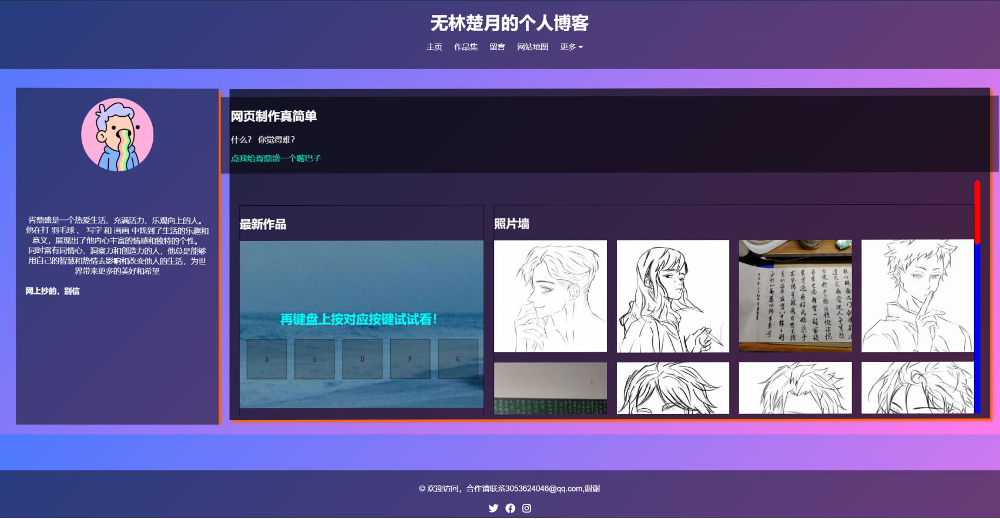
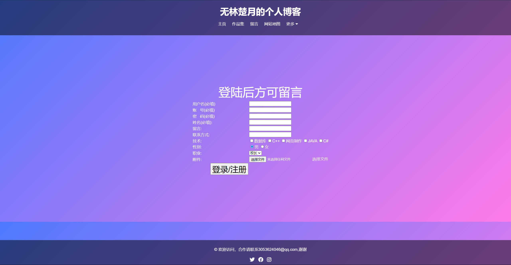

# 网站说明文档

## 1. 简介

- 1.1 网站概述
	- 我的个人博客网站是一个旨在分享个人观点、经验和技术知识的博客平台。我致力于为读者提供有价值的内容，涵盖技术、生活、学习和思考等多个领域。无论您是对技术领域充满热情的程序员、对生活感悟有着深刻见解的旅行者，还是对学术研究有着浓厚兴趣的学者，我们都希望能够为您带来有启发性和价值的内容。
	- 我们的博客涵盖了多个主题，包括但不限于：
		- **技术分享**：包括编程教程、开发经验分享、技术趋势分析等。
		- **生活感悟**：记录生活中的点滴、情感抒发、旅行见闻等。
		- **学术探索**：探讨学术研究成果、学术思考和学习心得。
		- **思维碰撞**：分享对于世界的思考、观点争鸣和思想碰撞。

## 2. 网站导航

- 2.1 网站结构

	## 1. 主页（Home）

	
	
	- 个人介绍
	- 最新作品展示
	- 照片墙
	- 热门评论展示

	## 2. 作品集（works）

	

	- 个人作品列表
	
	## 4. 关于我（Aboutme）
	
	
	
	- 作者帅气照片
	
	## 5. 留言（Message）
	
	
	
- 留言
	- 登录/注册页

	- 用户登录表单

	## 11. 后台管理页面（仅管理员，开发中）
	
	- 作品管理（发布、编辑、删除）
	- 留言管理（添加、编辑、删除）
	- 网站设置

## 3. 主题与设计

- 6.1 主题选择与定制
	- 主要灵感来自赛博朋克风，个人又比较喜欢简约一点，就采用了这种蓝粉渐变色背景，以及简约卡片的样式
- 6.2 页面布局
	- 多种多样

## 4. 技术架构

- 7.1 前端技术
	- 纯HTML，CSS，JS，纯手工打造专属个人博客，一点框架不带用的，主打技术流
- 7.2 后端技术
	- 准备采用nodejs的express框架
- 7.3 数据库管理
	- 准备采用mysql数据库，因为mysql为关系型数据库，有更好的信息表处理和各个表之间的关联，主要是因为mongodb不太熟练

## 5. 安全与备份

- 8.1 网站安全性
	- 仅限局域网访问，绝对安全
- 8.2 数据备份与恢复
	- 没有数据就不怕数据丢失，更不需要数据备份与恢复

## 6. 帮助与支持

- 11.1 常见问题解答
	- 联系15174630901
- 11.3 技术支持
	- 电话或视频为你解答

## 7. 版权声明

- 12.1 版权信息
- 12.2 使用许可